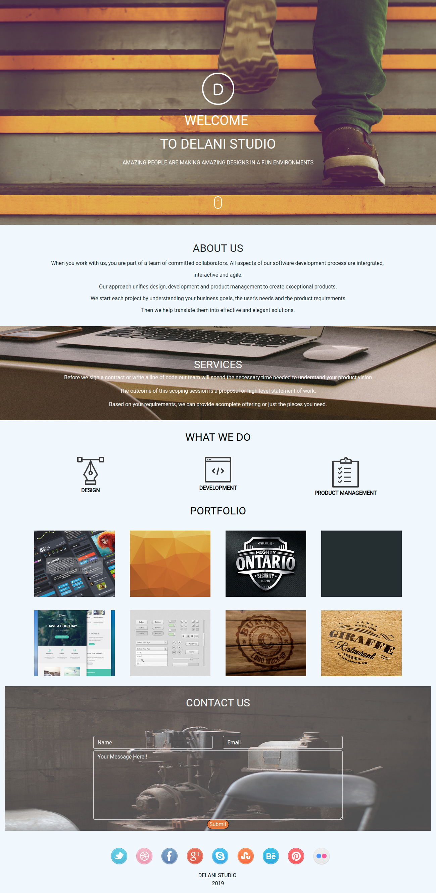

##Delani Studio Replicate

##Author
    Leonidah Mwamto

##Description
    - This is a replication of an existing site.
    - The difference with the original site is the        
       application of jQuery in manipulating the site's DOM.
    - In the site, the user is able to observe hidden content, hover over various portfolio projects and comment through a contact us form.

##Screenshot
    

## Technologies Used
    i. Bootstrap 
    ii. HTML
    iii. jQuery
    iv. javaScript

## List of Contributors
    Leonidah Mwamto

## BDD
    + This web page has enhanced interactivity
    + The user is able to get more hidden information after   clicking cursor enabled places
    + Also, on hover, the user is able to see the name of   
      the project

## Known Bugs
    The contact us form is not fully functional

## Installations
    To have this web app in your files, clone it from my github directory named Delani-Studio. Unzip the files within a folder suitable to you and use it as pleased.

## Licence
    MIT
    (https://choosealicense.com/licenses/mit/)